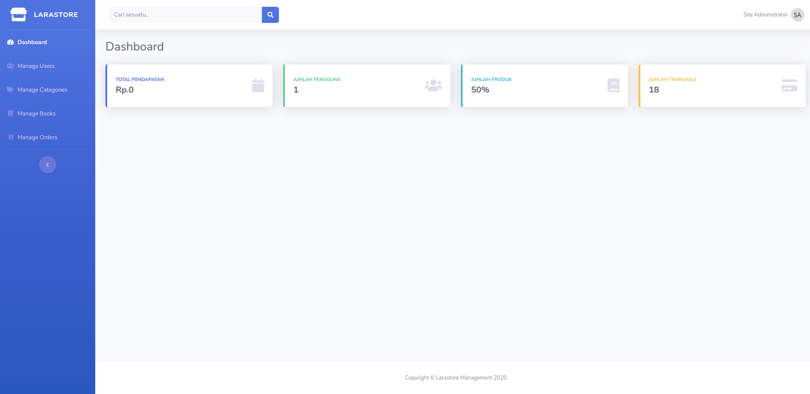

# Larastore
Online store management made with laravel.

## Installation
Clone this Repository
```bash
git clone https://github.com/kuscoders/larastore-management.git
```
Change Your directory to this Repository
```bash
cd larastore-management
```
Install all package  using composer
```bash
composer install
```
Copy environtment file and generate key
```bash
cp .env-example .env
php artisan key:generate
```

## Screenshoot

